# PROJECT-ANNE-S-LANGUAGE-RETREAT

## About the project

This project is a website for an actual BedandBreakfast. Included are four pages with the most relevant information visitors are looking for about a potential accomoodation to spend their holidays in.
The structure of the page allows for easy amendments to the information displayed and therefore is easily transferrable for use by another business.

## Table of Content

- About the project [About the project](## About the project)
- Features [Features](## Features )
  - Existing Features [Existing Featuress](### Existing Features)
  - Features left to implement [Features left to implement](### Features Left to Implement)
- Testing [Testing](## Testing)
  - Validator Testing [Validator Testin](### Validator Testing)
  - Unfixed Bugs [Unfixed Bugs](### Unfixed Bug)
- Deployment [Deployment](## Deployment)
- Credits [Credits](### Content)
  - Content [Contents](### Content)
  - Media [Media](### Median)
  - Special Thanks [Special Thanks](### Special Thanks)
- Other General Project Advice [FOther General Project Advic](## Other General Project Advice)

## Features 

### Existing Features

- __Colour Palette__

  - The color palettes used throughout the page are a soft autunm green, in shades from light bis dark, combined with a light shade of yellow for background and font. 
  - The green reflects the national color of Ireland, the colour of life and the shamrock. 
  - The yellow, in contrast to a clinical white, aims to give the user a feeling of home and comfort, invites them to stay and explore, and reflects the core value of the business to provide a home away from home.
  - Both colour schemes are easy on the eyes, creating an inviting atmosphere and giving the user a feeling of warmth and cosiness.

  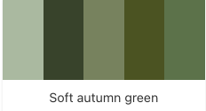  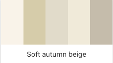

- __Navigation Bar__

  - Featured on all four pages, the full responsive navigation bar includes links to the Logo, Homepage, Room and Partners Page as well as to the Enquiry Form and is identical in each page to allow for easy navigation.
  - This section will allow the user to easily navigate from page to page across all devices without having to revert back to the previous page via the ‘back’ button. 

  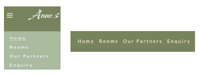    

- __The landing page__

  - The first feature, potential guests see when landing on the page, is an image of their holiday home, a traditional Irish Cottage, with a greeting in Irish and English underneath. This equally reflects the well-known and warm welcoming hospitality people come to Ireland for as it is a great sales pitch.
  - Combined with the image the Logo of the business above communicates clearly to potential guests what the business has to offer, a home away from home in a rural setting, perfect for a relaxing holiday, and an opportunity to practice or improve their language skills if so desired.

  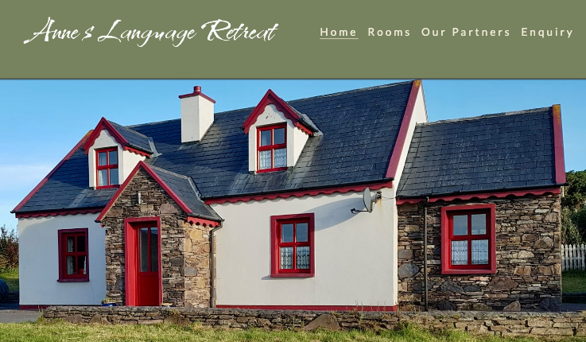

- __Intro Section__

  - The intro section provides the user with an overview of where the Bed and Breakfast is located and what the advantage is for them to book the place.
  - The intro section addresses both, the tourist, who visits the region specifically for exploring the Ring of Kerry, outlining the advantage of being located in the heart of the Ring of Kerry, and the language students, who is looking for a different type of language holidays off the beaten tracks, outlining the legitimacy of the language courses offered.

  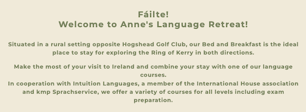

- __Overview__

  - This section provides the user with more details about the surrounding area, the facilities and touristic attractions located nearby.
  - To make the staying at the Bed and Breakfast even more appealing the paragraph not only informs the user about possible activities during their stay but also outlines that the business cooperates with mutiple providers directly, offering to assist with bookings which saves the potential guest the hassle of having to do reserach of their own.
  - A clickable link to the list of partners websites makes it easy for the user to learn more about the activities offered and serves also as another sales pitch for encouraging the user to contact the business as people also often associate the term "partner" automatically with "discount" which is offered by the partners when staying at Anne's Language Retreat.

  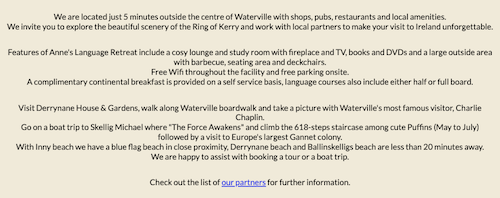

- __Video__
  - A short video, done by the owner of the business, at the end of the overview section whets the appetite of the user for more by showing them the beauty of the area they are going to travel to and advetising possible activities once more.

  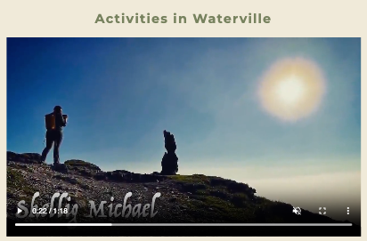

- __The Footer__ 

  - The footer section includes links to the relevant social media sites for Anne's Language Retreat. The links will open to a new tab to allow easy navigation for the user. 
  - The footer is valuable to the user as it encourages them to keep connected via social media.

  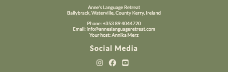

  - __Rooms__

  - This page shows the user the list of rooms they can choose from, including facilities and prices for single or double occupancy.
  
  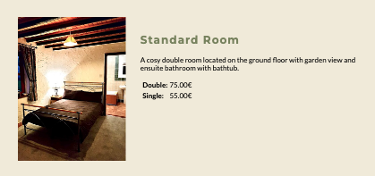

- __Partner Page__

  - The partner page includes the list of partners the business cooperates with inlcuding an overview about tours or products offered and their contact details. The links will open to a new tab to allow easy navigation for the user. 
  - This section is valuable for both, the user and the business. The user finds all informatin needed on that page and in case they only contact the partner, the partner will advertise the B&B and inform the user about the discounts offered when staying at the B&B.

  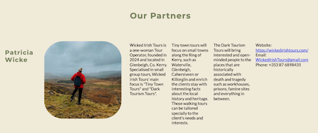

- __Enquiry form__

  - This page will allow the user to get in contact with the business.  The user will be asked to submit their name, phone number, email address and a brief message. Additionally they have a list of clickable options for information on a language courses. This field is optional.
  - Below the contact form the user finds the contact details of the business again as well as directions from Dublin and Cork Airport.
  
  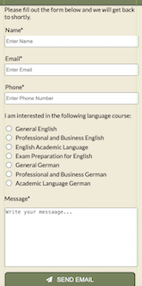
  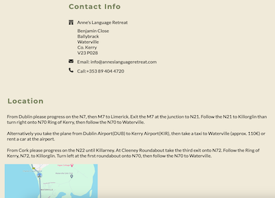

### Features Left to Implement

- Gallery page
- Captcha
- Translation of page to German, French, Spanish and Simple Chinese

## Testing 

In this section, you need to convince the assessor that you have conducted enough testing to legitimately believe that the site works well. Essentially, in this part you will want to go over all of your project’s features and ensure that they all work as intended, with the project providing an easy and straightforward way for the users to achieve their goals.

In addition, you should mention in this section how your project looks and works on different browsers and screen sizes.

You should also mention in this section any interesting bugs or problems you discovered during your testing, even if you haven't addressed them yet.

If this section grows too long, you may want to split it off into a separate file and link to it from here.

### Validator Testing 

- HTML
  - No errors were returned when passing through the official [W3C validator](https://validator.w3.org/nu/?doc=https%3A%2F%2Fmerzann.github.io%2FProject-Anne-s-Language-Retreat%2F)
- CSS
  - No errors were found when passing through the official [W3C CSS validator](https://jigsaw.w3.org/css-validator/validator?uri=https%3A%2F%2Fmerzann.github.io%2FProject-Anne-s-Language-Retreat%2F&profile=css3svg&usermedium=all&warning=1&vextwarning=&lang=en)

### Unfixed Bugs

All implemented elements are working as exspected. No bugs found during testing.
Future changes will include updating the media queries for enquiry.html to make use of the additional space on screens from 992px and Larger.

## Deployment

- The site was deployed to GitHub pages. The steps to deploy are as follows: 
  - In the GitHub repository, navigate to the Settings tab 
  - From the source section drop-down menu, select the Master Branch
  - Once the master branch has been selected, the page will be automatically refreshed with a detailed ribbon display to indicate the successful deployment. 

The live link can be found here - https://merzann.github.io/Project-Anne-s-Language-Retreat/ 

## Acknowledgement

### Content 

- The template used for building this project was provided by Code Institute on Github for student projects [ci-full-template](https://github.com/Code-Institute-Org/ci-full-template/)
- The icons in the footer were taken from [Font Awesome](https://fontawesome.com/)
- the color palettes used were created by color-hex [color-hex](https://www.color-hex.com/autumn-color-palettes/)
- Ideas on the general structure of a webpage and features that can be included were taken from 
  - the Walkthrough-Project by Code Institute [Love Running Walkthrough-Project](https://merzann.github.io/love-running/)
  - the Kilkea Castle Website [Kilkea Castle Webpage](https://www.kilkeacastle.ie/)
  - the Sika Lodge Website [Silka Lodge Webpage](https://sikalodgekillarney.com/)
- Instructions on how to write a ReadMe were taken from the YouTube video "How to make a ReadMe.md file! Easy way!" by Akash Pambhar [YouTube Akash Pambhar](https://www.youtube.com/watch?v=mb9FJzkwmwg/)

### Media

- The photos and video used on home and rooms belong to me to
- My partners consented to me using images and logo on the partner page

### Special Thanks

- Katja Ehrsam from wix.com for testing the page thoroughly and providing a second opinion
- Mandy Seiler, Doris McCann and Gudrun Michels for reviewing the website froma a customer's perspective and proving valuable Feedback
- Martina Williams for proof-reading

## Other General Project Advice

Below you will find a couple of extra tips that may be helpful when completing your project. Remember that each of these projects will become part of your final portfolio so it’s important to allow enough time to showcase your best work! 
